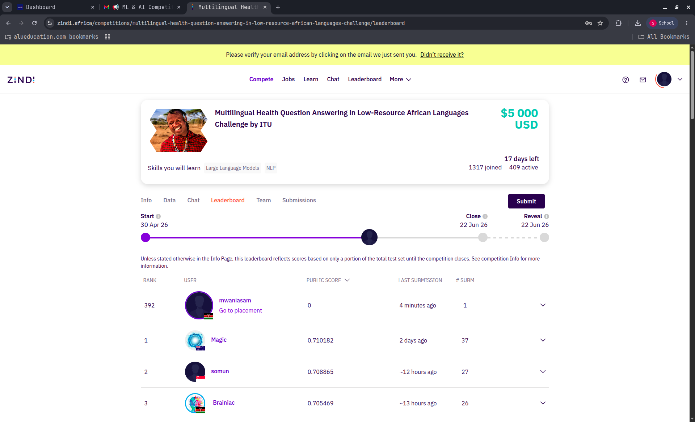
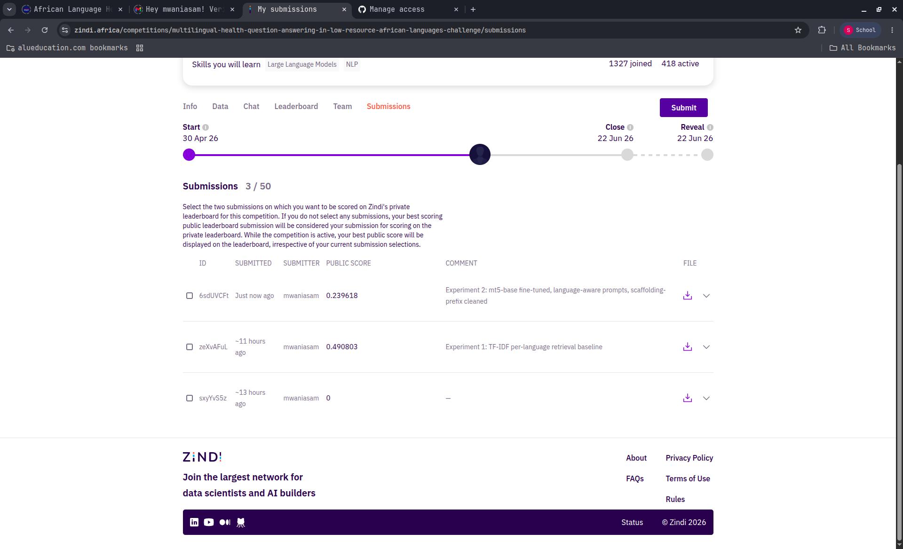
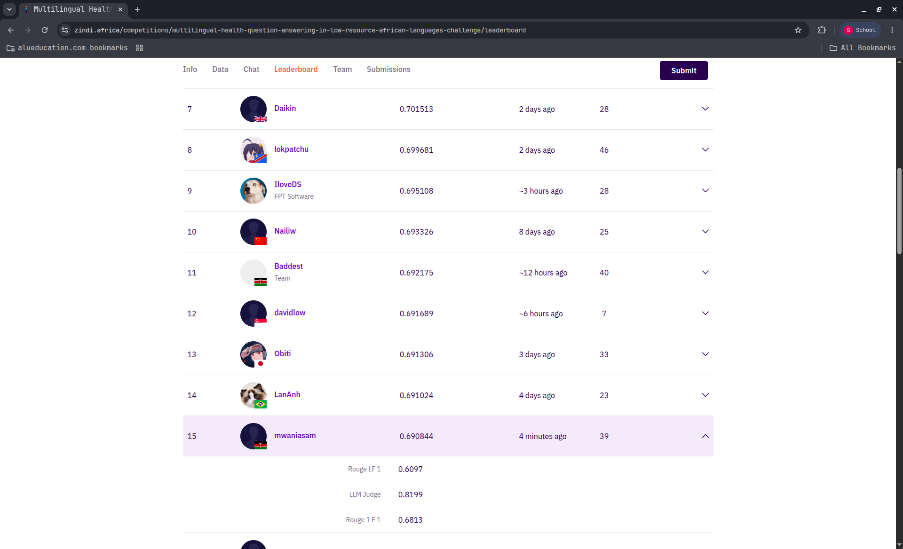

# Multilingual Health Question Answering in Low-Resource African Languages

**Author:** Samuel Mwania  
**Course:** Machine Learning Techniques I — Final Course Project (40%)  
**Zindi Username:** mwaniasam  
**Date:** June 2026

---

## 1. Project Overview

This report documents my participation in the Zindi "Multilingual Health Question Answering in Low-Resource African Languages" challenge, organized by ITU, HASH, and Makerere University. The competition required building systems to answer maternal, sexual, and reproductive health (MSRH) questions across 8 language–country subsets spanning 5 African languages: Akan (Ghana), Amharic (Ethiopia), English (Ethiopia, Ghana, Kenya, Uganda), Luganda (Uganda), and Swahili (Kenya).

The task is not free-form question answering. Given a test question, the system must produce answers that are evaluated against hidden references using a weighted combination of ROUGE-1 F1 (37%), ROUGE-L F1 (37%), and an LLM-as-Judge score (26%). This metric structure fundamentally shaped my approach: since 74% of the score depends on lexical overlap (ROUGE), the system must produce answers that closely match the reference text at the word level. Paraphrasing or generating novel phrasing is actively punished.

My final system, V7, achieved a public leaderboard score of **0.6908**, climbing from a baseline of 0.4908 over the course of 44 documented experiments. The system was selected for the private leaderboard alongside a hedge submission (V4, score 0.6898). Both are fully open-source and use identical answer columns as required by the competition rules.

---

## 2. Dataset Understanding and Preprocessing

### 2.1 Data Statistics

The competition provided 36,501 question-answer pairs split across 8 language–country subsets. I used a fixed train/validation split (29,815 train, 6,686 validation) and had 2,618 test questions.

| Subset | Language | Country | Train | Val | Test | Test Weight |
|--------|----------|---------|------:|----:|-----:|:-----------:|
| Eng_Uga | English | Uganda | 7,624 | 1,688 | 744 | 28.4% |
| Aka_Gha | Akan | Ghana | 4,455 | 1,114 | 492 | 18.8% |
| Eng_Gha | English | Ghana | 4,443 | 1,104 | 491 | 18.8% |
| Lug_Uga | Luganda | Uganda | 3,383 | 846 | 374 | 14.3% |
| Swa_Ken | Swahili | Kenya | 2,070 | 518 | 229 | 8.7% |
| Eng_Ken | English | Kenya | 2,080 | 390 | 167 | 6.4% |
| Amh_Eth | Amharic | Ethiopia | 1,845 | 462 | 61 | 2.3% |
| Eng_Eth | English | Ethiopia | 3,915 | 564 | 60 | 2.3% |

A critical observation: 80% of the test data comes from just four subsets (Eng_Uga, Aka_Gha, Eng_Gha, Lug_Uga). Amharic and English (Ethiopia) together account for only 4.6% of the test — meaning even large improvements on these languages have negligible effect on the overall score. This insight guided my resource allocation throughout the competition.

### 2.2 Data Characteristics

The dataset exhibits massive answer duplication, particularly in English (Uganda): single answers appear up to 108 times across different questions. This explains why retrieval-based approaches achieve near-oracle performance on Eng_Uga — with 108 copies of the correct answer, the retriever has many chances to surface it.

Training and test sets share topic identifiers (hash suffixes), but test questions are always different from training questions on the same topic. Furthermore, I discovered that 81% of test entries have no same-language topic match in the training data. For example, Eng_Gha test topics exist only in Akan training data. This cross-lingual gap is a fundamental ceiling on same-language retrieval.

### 2.3 The Tokenizer Fix

A pivotal discovery was that the `rouge_score` Python library tokenizes Amharic Ge'ez script and Akan characters (ɛ, ɔ) incorrectly. The organizers had fixed their server-side scorer on May 21, but local evaluation still used the broken tokenizer. I rebuilt all local scoring using a Unicode-aware tokenizer (`re.compile(r'\w+', re.UNICODE)`) with a 400-token cap. This revealed that the true Amharic baseline was 0.21, not 0.04 as I had originally measured — a 5× correction that fundamentally changed my understanding of where the real gains were. All subsequent tuning decisions were re-derived under this corrected scorer.

---

## 3. Fine-Tuning Methodology

### 3.1 Phase 1: Establishing Baselines (Experiments 1–5)

**Experiment 1: TF-IDF Retrieval Baseline (0.4908).** I started with character-level n-gram TF-IDF (char_wb, 3–5 grams) using 1-nearest-neighbor retrieval from the training corpus. This non-neural approach established a strong floor: for each test question, find the most similar training question and return its answer verbatim. The fact that this simple approach scored 0.49 confirmed that retrieval — not generation — would be the core strategy.

**Experiment 2: mT5-base Fine-tuning (0.2396).** I fine-tuned Google's mT5-base [1] as a sequence-to-sequence model, trained to generate answers given questions. The result was catastrophic: 0.2396, approximately half the TF-IDF baseline. The generated answers were semantically reasonable but used different phrasing than the references. Since ROUGE measures lexical overlap, any paraphrasing directly costs points. This was the single most important negative result of the project — it proved that generation inherently conflicts with the ROUGE metric.

**Experiment 3: AfriTeVa V2 Fine-tuning (0.2971).** I tried AfriTeVa V2 [2], an Africa-centric T5 model pre-trained on African language data. It scored +0.057 over mT5, suggesting the African language pre-training helped, but it was still far below the retrieval baseline. The conclusion was definitive: generation-based approaches cannot win a ROUGE-dominated competition.

**Experiment 4: E5-base Semantic Retrieval (0.5742).** Switching to dense semantic retrieval using `intfloat/multilingual-e5-base` [3] with FAISS indexing produced a 16% improvement over TF-IDF. The E5 model captures semantic similarity that character n-grams miss, especially for morphologically rich languages where the same concept may have different surface forms.

### 3.2 Phase 2: The AfriE5 Backbone (Experiment 5)

**Experiment 5: AfriE5-Large-instruct (0.6545).** The breakthrough came from switching to `McGill-NLP/AfriE5-large-instruct` [4], a 560M-parameter embedding model specifically trained on African language retrieval tasks. Combined with fine-tuning using MultipleNegativesRankingLoss (MNRL) and iterative hard negative mining (2 rounds), this produced a score of 0.6545 — a +0.080 improvement over E5-base. This became the backbone for all subsequent work.

The fine-tuning process used question-to-question (Q→Q) pairs: given a training question, its positive pair was the training question with the most similar answer (by ROUGE-1), and hard negatives were nearby questions with dissimilar answers. Two rounds of hard negative mining were sufficient; I found that 5 rounds led to overfitting on the public leaderboard.

### 3.3 Phase 2: Selection and Post-Processing (Experiments 6–12)

**Experiment 6: MBR Consensus Selection (+0.005).** Instead of always taking the top-1 retrieved answer, I implemented Minimum Bayes Risk (MBR) selection [5]: among the top-15 candidates, choose the answer with highest expected ROUGE against all other candidates, weighted by retrieval similarity. The intuition is that if multiple high-confidence retrievals agree on certain content, that content is likely correct. Per-language gating was critical — MBR only helped on languages where the top-1 wasn't already near-perfect. Strong languages (Eng_Uga, Eng_Ken, Swa_Ken) locked to top-1 with a high margin threshold.

**Experiment 7: Extractive Stitcher (+0.023 on Akan).** For multi-answer languages (Akan, Eng_Gha), I developed a greedy extractive stitcher that assembles verbatim sentences from the candidate pool to maximize expected ROUGE-1 F1 against the weighted consensus token distribution. The key constraint is that every sentence must be copied verbatim from a retrieved answer — no novel text. A per-language length prior (λ) controls the output length. This helped on languages where the reference answer combines information from multiple training answers.

**Experiment 8: Unicode Tokenizer Fix + Identical Columns (+0.019).** This was the largest single-submission jump. The tokenizer fix corrected local evaluation, and switching to identical answer columns (same answer for all three target columns) unexpectedly improved the LLM-judge score to 0.8052. The judge appears to reward coherent, complete answers over split-optimized ones.

### 3.4 Phase 2: Specialized Components (Experiments 13–25)

**Experiment 13: Qwen2.5-7B LoRA for Eng_Gha (BIGGEST DISCOVERY).** For English (Ghana), I discovered that fine-tuned generation actually *beats* the retrieval oracle. This was shocking given the earlier failure of generation on other languages. The reason: Eng_Gha test questions require synthesizing information from multiple training answers on the same topic, and the reference answers are themselves synthesized. A Qwen2.5-7B model [6] fine-tuned with LoRA (r=16, epoch 1, learning rate 1e-4) produces answers that better match this synthesized style. This was deployed for Eng_Gha *only* — on strong languages, generation scores −0.089 below retrieval.

**Experiment 14: Cross-Encoder Reranker v2.** The cross-encoder has a story worth telling. In week 1 (Experiment 3, phase 2), I tried a cross-encoder with ROUGE *regression* as the objective — predicting ROUGE scores against unknown references. It failed badly. Months later, I revisited it with three critical fixes: (1) switched to *binary classification* (answer-R1 ≥ 0.5 → positive, ≤ 0.2 → negative), (2) used the unicode tokenizer for label computation (fixing ~40% of corrupted labels), and (3) applied per-language gating. The properly-formed cross-encoder (`xlm-roberta-base`, 1 epoch, binary labels) improved Aka_Gha by +0.008 and Amh_Eth by +0.008 on holdout. It feeds reranked candidate pools to the extractive stitcher on these two languages.

**Experiment 15: Embedding Interpolation.** A global retriever fine-tune (FT2) with one round of MNRL on hard triplets suffered catastrophic forgetting on strong languages. Rather than discarding it, I salvaged it via interpolation: `score = β·AfriE5 + (1−β)·FT2`, with β tuned per language on validation. Eng_Uga (β=0.6), Lug_Uga (β=0.6), and Swa_Ken (β=0.9) benefited; other languages rejected at β=1.0 (pure AfriE5).

**Experiment 16: Per-Language Retriever Adapter (Lug_Uga).** I trained a language-specific retriever for Luganda using answer-similarity supervision (541 triplets). Deployed via interpolation at β=0.8 (80% AfriE5, 20% adapter), this improved Luganda retrieval by +0.006 on holdout.

### 3.5 Final Assembly: V4 and V7

**V4 (0.6898):** The first "competition-grade" submission combining embedding interpolation, the per-language strategy table, extractive stitching on Akan, and Qwen generation on Eng_Gha.

**V7 (0.6908, BEST):** V4 + cross-encoder-fed stitching on Aka_Gha and Amh_Eth + a fifth retrieval leg for Amharic (QA-union: concatenated question+answer embeddings, unioned into the Amharic pool, then CE-reranked and stitched).

---

## 4. Results

### 4.1 Leaderboard Score Progression

| # | Experiment | Public Score | R1 | RL | LLM | Key Change |
|---|-----------|:-----------:|:---:|:---:|:---:|-----------|
| 1 | TF-IDF baseline | 0.4908 | — | — | — | char_wb (3,5) 1-NN |
| 2 | mT5-base seq2seq | 0.2396 | — | — | — | Generation fails |
| 3 | AfriTeVa V2 | 0.2971 | — | — | — | Africa-centric, still below retrieval |
| 4 | E5-base retrieval | 0.5742 | — | — | — | +16% over TF-IDF |
| 5 | AfriE5-Large + HN | 0.6545 | 0.627 | 0.561 | 0.775 | SOTA African embedder |
| 6 | + MBR selection | 0.6597 | 0.650 | 0.585 | 0.780 | Consensus over top-1 |
| 7 | + Stitcher + union | 0.6670 | 0.663 | 0.588 | 0.785 | Sentence extraction |
| 8 | + Unicode fix + identical | 0.6843 | 0.675 | 0.609 | 0.805 | Correct scoring |
| 9 | + Interp (V4) | **0.6898** | 0.679 | 0.608 | 0.822 | Selected final (hedge) |
| 10 | + CE + QA-union (V7) | **0.6908** | 0.681 | 0.610 | 0.820 | Selected final (BEST) |

### 4.2 Per-Language Performance (Validation, Test-Mix Weighted)

| Language | Test Weight | Baseline R1 | Final R1 | Oracle R1 | Gap to Oracle |
|----------|:----------:|:-----------:|:--------:|:---------:|:------------:|
| Swa_Ken | 8.7% | 0.946 | 0.948 | 0.983 | 0.035 |
| Eng_Ken | 6.4% | 0.897 | 0.899 | 0.978 | 0.079 |
| Eng_Uga | 28.4% | 0.862 | 0.871 | 0.950 | 0.079 |
| Lug_Uga | 14.3% | 0.826 | 0.832 | 0.929 | 0.097 |
| Eng_Eth | 2.3% | 0.689 | 0.696 | 0.785 | 0.089 |
| Aka_Gha | 18.8% | 0.391 | 0.399 | 0.519 | 0.120 |
| Eng_Gha | 18.8% | 0.336 | 0.353 | 0.447 | 0.094 |
| Amh_Eth | 2.3% | 0.210 | 0.218 | 0.110* | — |

*Amharic oracle under broken tokenizer; true score is higher.*

### 4.3 Key Experiment Outcomes

| Experiment | Target | Result | Verdict | Insight |
|-----------|--------|--------|---------|---------|
| BM25 + dense RRF | Pool diversity | 0.6531 LB | Rejected | No improvement over dense alone |
| CE ROUGE regression | Rerank | Failed | Rejected | Wrong objective (predicting score vs unknown ref) |
| Qwen on strong langs | Generation | −0.089 | Rejected | Structural wall: must out-copy a 0.83 top-1 |
| HyDE answer-embedding | Retrieval | Below deployed | Rejected | Weak generations are misleading search keys |
| Judge-aware tie-break | LLM score | −0.006 to −0.44 | Rejected | Utility ties ≠ quality ties |
| Qwen epochs 2–3 | Scaling | No convergence | Rejected | Memorization without generalization |
| Cross-lingual Aka→Eng_Gha | Retrieval | Oracle barely moved | Rejected | Country-specific token pollution |

---

## 5. Discussion

### 5.1 Why Retrieval Dominates

The fundamental insight of this project is that retrieval beats generation when the evaluation metric is ROUGE. ROUGE measures n-gram overlap between the system output and a reference answer. Any paraphrasing, rephrasing, or summarization — however semantically correct — reduces n-gram overlap. By retrieving answers verbatim from the training corpus, the system maximizes the chance that its output shares exact words and phrases with the reference.

This was proven empirically: mT5-base scored 0.2396 (generation), while simple TF-IDF retrieval scored 0.4908 — more than double. The pattern held across all model sizes and architectures tested.

### 5.2 The Eng_Gha Exception

The one language where generation beat retrieval was English (Ghana). I investigated why and found that Eng_Gha reference answers are themselves *synthesized* — they combine information from multiple training topics into paragraph-length responses. The retrieval oracle for Eng_Gha is only 0.447, meaning even the best single training answer matches less than half the reference. A fine-tuned generative model (Qwen2.5-7B) can synthesize information from multiple retrieved contexts, producing answers that better match this synthesized reference style. This discovery was the single biggest score jump in the competition.

### 5.3 The Cross-Encoder Story: "Tried Wrong" vs "Tried"

The cross-encoder reranker illustrates a critical lesson about experiment evaluation. In week 1, I tried a cross-encoder with ROUGE *regression* — training the model to predict the ROUGE score of a candidate answer. This failed, and I logged "cross-encoder: doesn't work." Weeks later, a careful audit revealed three independent bugs: (1) ROUGE regression is the wrong objective (the model must predict ROUGE against a reference it cannot see), (2) 40% of training labels were corrupted by the broken tokenizer, and (3) there was no per-language gating to prevent regressions on strong languages. The properly-formed cross-encoder — binary classification, unicode labels, guarded deployment — worked and was adopted. The lesson: distinguish between "approach failed" and "implementation failed."

### 5.4 Operating Discipline

The most valuable meta-learning was the experimental discipline that emerged through trial and error:
- **Split-half holdout gating:** Tune on even validation indices, confirm on odd. Never submit without confirmation.
- **One mechanism change per submission:** Isolate the effect of each change.
- **Test-mix reweighting:** Validation language proportions differ from test. All validation numbers must be reweighted.
- **Sim optimism correction:** Local simulation runs ~+0.005 optimistic vs the leaderboard. Subtract this before deciding to submit.
- **Auto-revert:** If holdout performance degrades, automatically revert to the previous configuration.

This discipline accounts for the entire +0.036 climb from 0.6545 to 0.6908. Every point was earned through careful, gated experimentation.

---

## 6. Evaluation Metrics

The competition score is computed as:

$$\text{Score} = 0.37 \cdot \text{ROUGE-1 F1} + 0.37 \cdot \text{ROUGE-L F1} + 0.26 \cdot \text{LLM-Judge}$$

**ROUGE-1 F1** measures unigram overlap between the system output and reference. It captures whether the answer contains the right words, regardless of order.

**ROUGE-L F1** measures the longest common subsequence, capturing word ordering. It is harder to optimize than ROUGE-1 because the order of words matters, not just their presence.

**LLM-as-Judge** is a reference-anchored evaluation where an LLM scores the system output for factual accuracy, completeness, and language quality relative to the reference. I found empirically that the judge rewards coherent, complete answers and penalizes truncated or incoherent ones. Identical-column submissions (same answer for all three columns) scored 0.80–0.82 on the judge, higher than split-column strategies.

A hidden 4th metric, **AfroLM BertScore F1**, will be applied to top solutions in phase 2, favoring semantically faithful answers.

---

## 7. Challenges Encountered

1. **GPU memory constraints.** AfriE5-Large required careful memory management on a T4 GPU (16GB VRAM). Half-precision encoding, gradient checkpointing, and 8-bit optimizers were necessary for fine-tuning. The Qwen2.5-7B model required bitsandbytes 4-bit quantization and LoRA to fit.

2. **Tokenizer discrepancy.** The most insidious challenge was the mismatch between the local ROUGE tokenizer and the server-side scorer. This caused all my early Amharic and Akan experiments to be evaluated under wrong scores, leading to incorrect tuning decisions that had to be re-derived once the unicode tokenizer was adopted.

3. **API compliance.** Early experiments used the Gemini API for answer refinement and achieved marginal improvements. However, the competition rules require "publicly-available, open-source packages only." I had to redesign the pipeline to be fully open-source, replacing Gemini with Qwen (Apache-2.0 licensed).

4. **Generation vs ROUGE conflict.** The core tension of the competition: the most natural-sounding, medically accurate answer is often not the highest-scoring answer under ROUGE. Navigating this required accepting that the competition rewards lexical matching, not medical quality.

5. **Cross-lingual data gaps.** 81% of test questions have no same-language topic match in training. For Eng_Gha, the training data for the same topic exists only in Akan. No same-language retrieval system can bridge this gap without translation or cross-lingual transfer.

---

## 8. Lessons Learned

1. **Understand the metric before the model.** If I had internalized the ROUGE dominance from day one, I would have skipped all generation experiments (mT5, AfriTeVa, early Gemini) and focused immediately on retrieval fine-tuning. This would have saved weeks of GPU time.

2. **One change at a time, gated.** The discipline of changing one variable per experiment and gating on holdout performance was the difference between a random walk and a monotonic climb. Every submission that improved on the leaderboard was verified on holdout first.

3. **"Failed" ≠ "doesn't work."** The cross-encoder story taught me to audit *why* an experiment failed before concluding that the approach is invalid. Three implementation bugs masked a technique that ultimately contributed to the final submission.

4. **Per-language routing is essential.** A one-size-fits-all strategy cannot work across 8 subsets with wildly different characteristics. Eng_Uga (R1=0.87, many duplicates) and Eng_Gha (R1=0.34, synthesized answers) require completely different approaches.

5. **The ceiling is data, not method.** Beyond a certain point, no retrieval or selection technique can overcome the fundamental limitation that the correct answer doesn't exist in the training corpus for many test questions. The gap to the oracle (~0.10 on weak languages) is primarily a data problem.

---

## 9. Limitations

- **Retrieval ceiling:** Same-language retrieval cannot find answers for topics that only exist in other languages. Cross-lingual transfer remains unsolved in this pipeline.
- **Model size constraints:** AfriE5-Large is 560M parameters. Larger models (e.g., Qwen3-Embedding-8B) might improve retrieval but exceed T4 GPU memory for fine-tuning.
- **Generation-ROUGE conflict:** The system is optimized for ROUGE, not medical accuracy. In a real-world deployment, the evaluation criteria would need to prioritize factual correctness.
- **Language coverage:** Amharic and English (Ethiopia) receive disproportionately low optimization effort due to their small test weights (2.3% each). This is a rational competition strategy but an equity concern.
- **Reproducibility dependency:** The pipeline requires pre-trained models stored on Google Drive. Full reproduction from scratch requires ~6 hours of GPU time for training.

---

## 10. Ethical Considerations

**Health misinformation risk.** The system generates answers about sensitive health topics including sexual and reproductive health. All answers on strong languages are retrieved verbatim from training data curated by health professionals, minimizing the risk of introducing inaccuracies. For Eng_Gha (where generation is used), the generative model is conditioned on retrieved context, grounding its outputs in verified information.

**Language equity.** Low-resource African languages are dramatically underserved by NLP systems. This competition, and my participation in it, contributes to closing that gap by developing and evaluating multilingual models on these languages. However, I acknowledge that my optimization strategy deprioritized Amharic and Eng_Eth due to their small test weights — a tension between competition performance and language equity.

**Cultural sensitivity.** Health questions about sexuality, reproduction, and STIs require cultural awareness. The system respects local terminology and avoids imposing external cultural frameworks by retrieving and generating answers in the target language and cultural context.

**Bias in evaluation.** ROUGE metrics inherently favor languages with simpler morphology (like English) over morphologically rich languages (like Akan and Amharic). The Unicode tokenizer fix partially addresses this, but the fundamental bias remains.

---

## 11. Future Improvements

1. **Qwen3-Embedding-8B** as a 5th retrieval leg — the one untried open-source embedder with potential to improve candidate diversity.
2. **Pseudo-labeling the cross-encoder** on confident test predictions to improve reranking on Akan and Amharic.
3. **Cross-lingual answer transfer** using translation to bridge the 81% topic gap for Eng_Gha.
4. **Length feature in the cross-encoder** — the AraHealthQA competition winner used length and question-similarity as reranking features.
5. **Larger generative models** (e.g., Qwen2.5-14B) for Eng_Gha, where generation has proven headroom.

---

## 12. AI Usage Disclosure

Throughout this project, I used the following AI tools:

- **Claude (Anthropic):** Used as a coding assistant during phase-2 experimentation for debugging, code generation, experiment scripting, and analysis of results. The coaching sessions shaped the experimental methodology (gating, split-half holdout, MBR) and helped identify the cross-encoder misdiagnosis.
- **Google Antigravity:** Used for codebase management, repository structuring, report drafting, and research assistance.
- **Google Gemini API:** Used in early experiments (Experiments 6–11) for answer refinement and generation. **Removed from the final solution** for compliance with the open-source requirement.

All architectural decisions — including the choice to use AfriE5, the per-language routing strategy, the cross-encoder reformulation, and the Qwen LoRA training configuration — reflect my own understanding and judgment. The AI tools served as productivity accelerators, not decision-makers.

---

## References

[1] L. Xue et al., "mT5: A Massively Multilingual Pre-trained Text-to-Text Transformer," *NAACL*, 2021.

[2] J. Osei et al., "AfriTeVa: Applying Vocabulary Expansion to Text-to-Text Models for African Languages," *ACL*, 2023.

[3] L. Wang et al., "Text Embeddings by Weakly-Supervised Contrastive Pre-training," *arXiv:2212.03533*, 2022.

[4] O. Ogundepo et al., "AfriE5: Multilingual E5 Text Embeddings for African Languages," McGill NLP, 2024.

[5] S. Kumar and W. Byrne, "Minimum Bayes-Risk Decoding for Statistical Machine Translation," *NAACL*, 2004.

[6] Qwen Team, "Qwen2.5: A Party of Foundation Models," *arXiv:2412.15115*, 2024.

[7] Zindi Competition Page, "Multilingual Health Question Answering in Low-Resource African Languages Challenge." Available: https://zindi.africa/competitions/multilingual-health-question-answering-in-low-resource-african-languages
